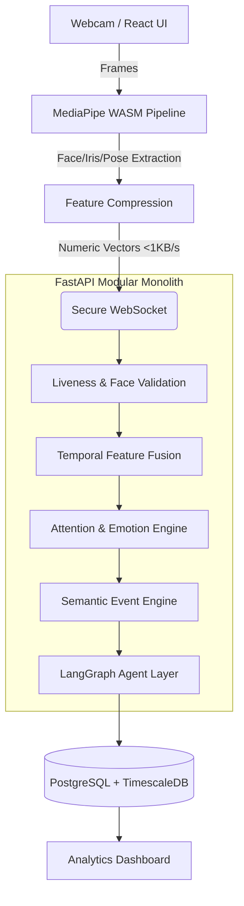

# FocusAI: Cognitive Telemetry Engine 🧠

A real-time, privacy-first cognitive state monitoring and behavioral analytics platform. FocusAI leverages client-side computer vision to extract high-dimensional biometric telemetry and streams it to a scalable modular monolith backend. Using a hybrid ML and rule-based architecture alongside an Agentic AI layer, the system generates continuous behavioral insights and dynamic analytics.


## 🚀 Core Features

- **Edge AI Vision Pipeline:** Deploys optimized PyTorch and ONNX models via WebAssembly for sub-50ms client-side inference, extracting 3D facial coordinates without transmitting raw video.
- **Multi-Modal Behavioral Engine:** Fuses 3D facial landmarks, head pose matrices, and Facial Action Units (FACS) across sliding time-windows to accurately predict attention, classify emotions, and track cognitive load.
- **Agentic AI Reasoning Layer:** Utilizes LangGraph and RAG (Retrieval-Augmented Generation) to query high-frequency time-series telemetry, generating automated behavioral insights and engagement analytics.
- **Real-Time Event Engine:** Detects complex semantic events (e.g., blink bursts, yawning, distraction) and ensures continuous presence verification.
- **Enterprise-Grade Infrastructure:** Designed as a highly scalable modular monolith utilizing FastAPI, Redis, PostgreSQL, and TimescaleDB, all containerized via Docker Compose.

---

## 🛠️ Final Tech Stack

| Layer | Technology |
| :--- | :--- |
| **Frontend** | React + TypeScript + Tailwind CSS |
| **Real-time Communication** | Secure WebSocket |
| **Backend** | FastAPI (Modular Monolith) |
| **CV Framework** | Google MediaPipe (Face Mesh, Iris, Pose) |
| **ML Framework** | PyTorch + ONNX Runtime |
| **Emotion Model** | Fine-tuned CNN/ViT + Temporal Model |
| **Attention Engine** | Multi-modal Rule + ML Hybrid |
| **Agent Framework** | LangGraph / PydanticAI |
| **Structured Database** | PostgreSQL |
| **Time-Series Database** | TimescaleDB Extension |
| **Cache & Auth** | Redis, JWT |
| **Deployment** | Docker Compose |

---

## 🏗️ High Level Design (Production HLD)



---

## 🧠 Low Level Processing Pipeline

1. **Feature Extraction Engine:** Calculates Eye Aspect Ratio (EAR), Mouth Aspect Ratio (MAR), Iris Gaze displacement, and Head Pose (Pitch, Roll, Yaw).
2. **Temporal Buffer:** Applies a 5-second sliding window to track motion history, smooth feature jitter, and detect moving statistical trends.
3. **Attention Scoring Model:** A weighted fusion model tracking Eye Gaze (20%), Head Pose (15%), Posture (15%), EAR (10%), and Facial Expressions (10%).
4. **Agent Layer:** Routes parsed data through specialized LLM agents (Attention Agent, Emotion Agent, Engagement Agent) to build explainable reports.

---

## 🗄️ Database Architecture

The system utilizes a single PostgreSQL server with the **TimescaleDB** extension enabled, conceptually split into relational data and high-frequency hypertables.

### Relational Data (PostgreSQL)
- `users`, `sessions`, `roles`, `permissions`, `reports`

### High-Frequency Telemetry (TimescaleDB)
- `attention_timeline`: Continuous focus scoring.
- `emotion_timeline`: Real-time cognitive states.
- `facial_metrics`: Granular tracking of EAR, MAR, blink_rate, smile_type, gaze_x/y, head_pitch.
- `body_metrics`: Posture, shoulder_angle, hand_position.
- `behavioral_events`: Discrete state changes (e.g., `LOOK_AWAY`, `BLINK_BURST`, `YAWN`).

---

## 💻 Getting Started

### Prerequisites
- Docker & Docker Compose
- Node.js (v18+)

### 1. Start the Backend Infrastructure
The backend and databases are fully containerized.
```bash
# Start FastAPI, PostgreSQL, TimescaleDB, and Redis
docker-compose up -d --build
```
*The API will be available at `http://localhost:8000`.*

### 2. Start the Frontend Application
```bash
cd frontend
npm install
npm run dev
```
*The dashboard will be available at `http://localhost:3000`.*

---

## 📄 License
This project is licensed under the MIT License.
