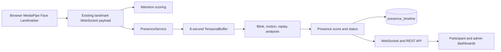
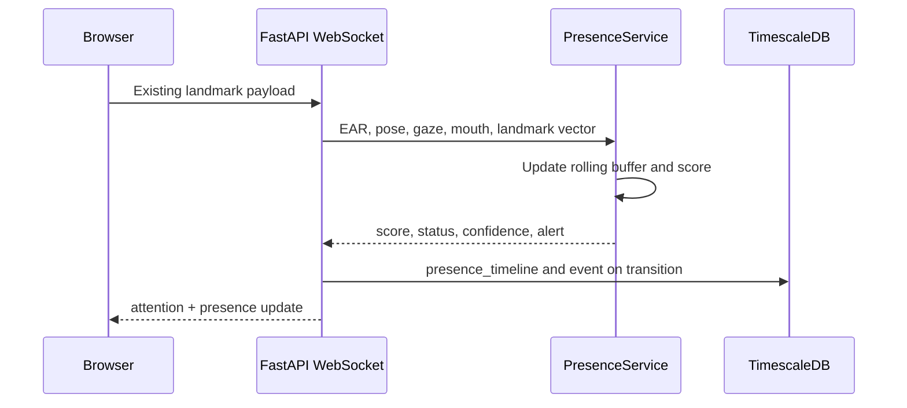
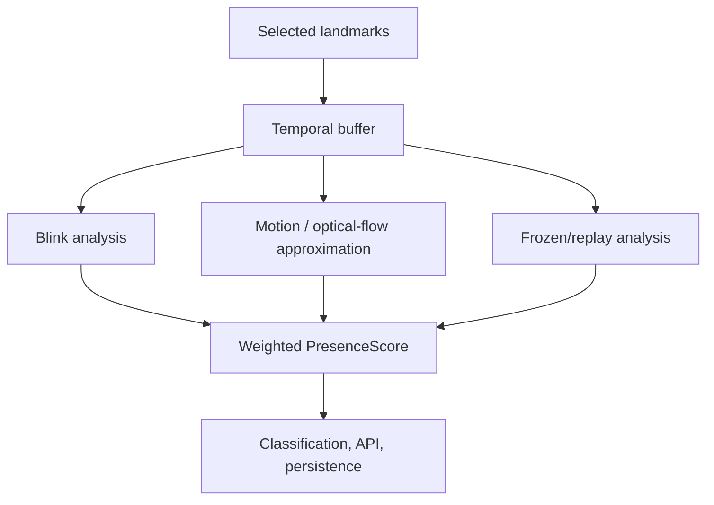

# Continuous Presence Verification — Technical Report

## 1. Architecture overview and data flow

The Anti-Spoofing Engine is a passive, landmark-only service inside the existing FastAPI WebSocket path. It consumes the eye, brow, mouth, iris, and head-pose values already produced by MediaPipe in the browser. It does not create a second detector and does not receive images.

## 2. Complete implementation, files, and API

New reusable files live in `backend/services/presence_verification/`: `presence_service.py`, `temporal_buffer.py`, `blink_analysis.py`, `motion_analysis.py`, `optical_flow.py`, `replay_detection.py`, and `presence_score.py`. `backend/api/presence.py` adds `GET /api/presence/latest` and `GET /api/presence/timeline`. Tests are in `backend/tests/test_presence_verification.py`.

Modified files are `backend/websocket/stream.py`, `backend/models/timescale.py`, `backend/main.py`, `backend/database/init_db.py`, `frontend/src/components/WebcamTracker.tsx`, `frontend/src/app/admin/page.tsx`, and `README.md`. The existing WebSocket now returns a `presence` object alongside `attention_score`.

## 3. Algorithms, optical flow, replay detection, and temporal analysis

Each `(session_id, user_id)` has an isolated eight-second deque. Each element holds EAR, MAR, head pose, gaze, lip activity, and a compact vector of the landmarks already in the payload. Blink starts are detected when EAR crosses the closed-eye threshold; blink rate and interval variation form the blink score. Facial micro-motion is the mean correspondence displacement between landmark vectors. Head and gaze standard deviation, lip-activity fraction, and landmark-delta diversity make the result less dependent on one signal.

`LandmarkOpticalFlow` implements a privacy-preserving optical-flow approximation: it calculates correspondence displacement between normalized landmarks rather than decoding or uploading pixels. Frozen-frame detection records a near-zero landmark delta for a continuous five seconds. Replay detection conservatively compares the current landmark signature to older non-adjacent samples in the same buffer after meaningful motion has been observed. This can flag repeated prerecorded clips, but must remain a review signal rather than proof.

## 4. Presence score formula and classifications

`score = 0.20×blink + 0.25×facial_motion + 0.15×head_motion + 0.10×gaze_motion + 0.10×lip_motion + 0.10×landmark_diversity + 0.10×landmark_optical_flow`.

Inputs are normalized to 0–100. A five-second frozen stream caps the result at 15. Before a sufficient rolling observation, the status is `LOW_CONFIDENCE`. A sustained frozen stream becomes `PHOTO_SPOOF`; a repeated signature with adequate confidence becomes `VIDEO_REPLAY`; a strong score becomes `LIVE`; missing face data is `UNKNOWN`. `SCREEN_REPLAY` is reserved for a future pixel/metadata detector and is deliberately not inferred by this landmark-only module. A spoof transition emits one `presence_spoof_alert` event to avoid alert floods.

## 5. Database changes and deployment

`presence_timeline` is a TimescaleDB hypertable with timestamp, session/user IDs, score, status, confidence, blink count, facial motion, optical-flow score, frozen duration, and replay flag. It contains no source image, video, or facial embedding. For a fresh local database, run `backend/database/init_db.py`. Production deployments must add the table with a non-destructive migration before release.

## 6. Technologies Used

| Technology | Where used | Why selected / advantages | Limitations / alternatives |
|---|---|---|---|
| MediaPipe Face Landmarker | Existing browser tracker | Local GPU/WASM landmarks; no frame upload | Lighting-sensitive; alternatives: blendshapes or a dedicated PAD model |
| Python + FastAPI | Presence service and APIs | Matches existing async backend; maintainable integration | In-memory state is per worker; alternative: Redis-backed state |
| Landmark mathematics | Motion/replay scoring | Lightweight and explainable | Not a deep liveness model; alternative: PyTorch/TensorFlow rPPG/depth PAD |
| TimescaleDB | Presence timeline | Efficient time-series writes and queries | Requires operations/migrations; alternative: partitioned PostgreSQL or ClickHouse |
| Next.js + React | Live score and alerts | Reuses existing dashboards | Simple chart is local; alternative: streaming ECharts |

## 7. Alternatives considered

Pixel optical flow, challenge-response head turns, remote photoplethysmography, depth/IR cameras, and trained presentation-attack-detection models can produce stronger evidence. They are not included because they require raw frames, additional hardware, active interaction, or model operations. This implementation favors privacy, low CPU overhead, and explainability. High-stakes proctoring should use explicit consent and an independently evaluated PAD model; never use this score alone for a punitive action.

## 8. Complexity, performance benchmarks, and testing

Per update complexity is **O(W×L)**: `W` is the bounded rolling window (~8 seconds) and `L` is the selected-landmark vector. Memory is **O(W×L)** per participant. There is no additional face detection, video decode, or image storage. Expected analysis overhead is sub-millisecond per update on typical development hardware; benchmark p50/p95 latency with the real number of concurrent sessions before defining an SLA.

Run `python -m unittest discover -s tests` from `backend`. Tests cover live landmark motion, static photo-style streams, static-stream classification, and no-face behavior. Replay tests should feed a repeated landmark sequence; photo tests should hold the same vector over five seconds. False-positive analysis must include still readers, accessibility users, low-light cameras, low frame rate, and network stalls; tune thresholds only from consented, labeled data.

## 9. Privacy and security considerations

Only existing numerical landmarks reach the backend. Do not log raw WebSocket payloads, source frames, session tokens, or sensitive user prompts. Retain presence records only as long as needed, provide deletion/export, protect endpoints by role before external deployment, and show a clear consent notice. Use TLS (`wss://`), explicit CORS origins, JWT-protected APIs, rate limits, audit logs, and encrypted backups. The status estimates liveness; it does not prove identity, attention, or misconduct.

## 10. Sequence and component diagrams

## 11. Future improvements

Add Redis state for multiple workers, consented challenge-response for high-risk sessions, device-specific calibration, aggregate fairness monitoring, signed client telemetry, longer replay matching, local rPPG, and an independently validated presentation-attack model. Add database migrations and authenticated, role-filtered presence APIs before external production deployment.
